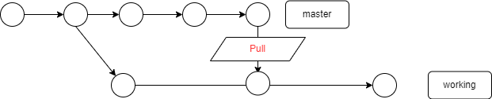

# AutoBranchUpdate

[](https://app.travis-ci.com/jacoloves/AutoBranchUpdate)
[](https://goreportcard.com/report/github.com/jacoloves/AutoBranchUpdate)

A tool that automatically reflects the latest master branch in your working branch.   

# Requirement
・Linux   
・MacOS   
・Windows(use [WSL](https://learn.microsoft.com/en-us/windows/wsl/install))   

# Installation
```go
go get github.com/jacoloves/AutoBranchUpdate
```

# License
Distributed under MIT License. See LICENSE.
